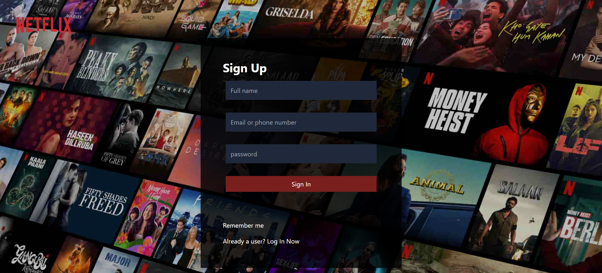
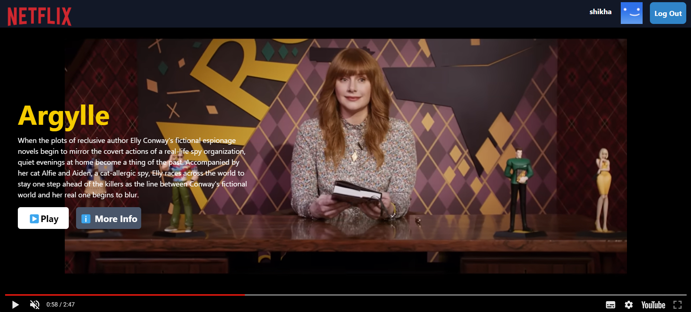
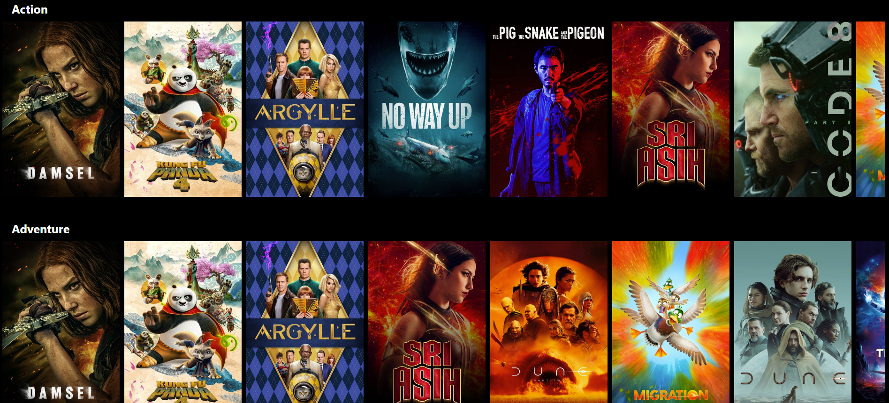
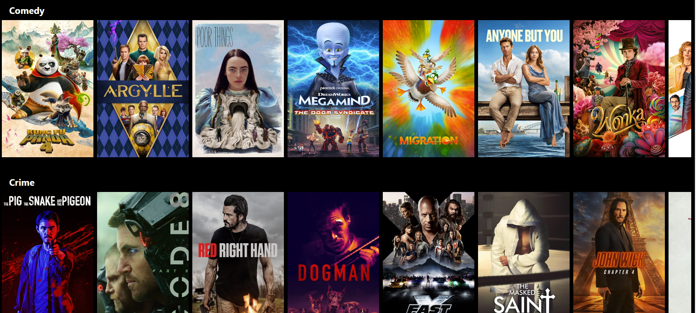

# This project is Netflix clone

This App was created to mimick the Netflix functionality. It uses firebase auth for signup & login.
For movies browse it consumes movie db API's.

## Screenshots

## Available Scripts

In the project directory, you can run:

### `npm start`

Runs the app in the development mode.\
Open [http://localhost:3000](http://localhost:3000) to view it in your browser.

The page will reload when you make changes.\
You may also see any lint errors in the console.

